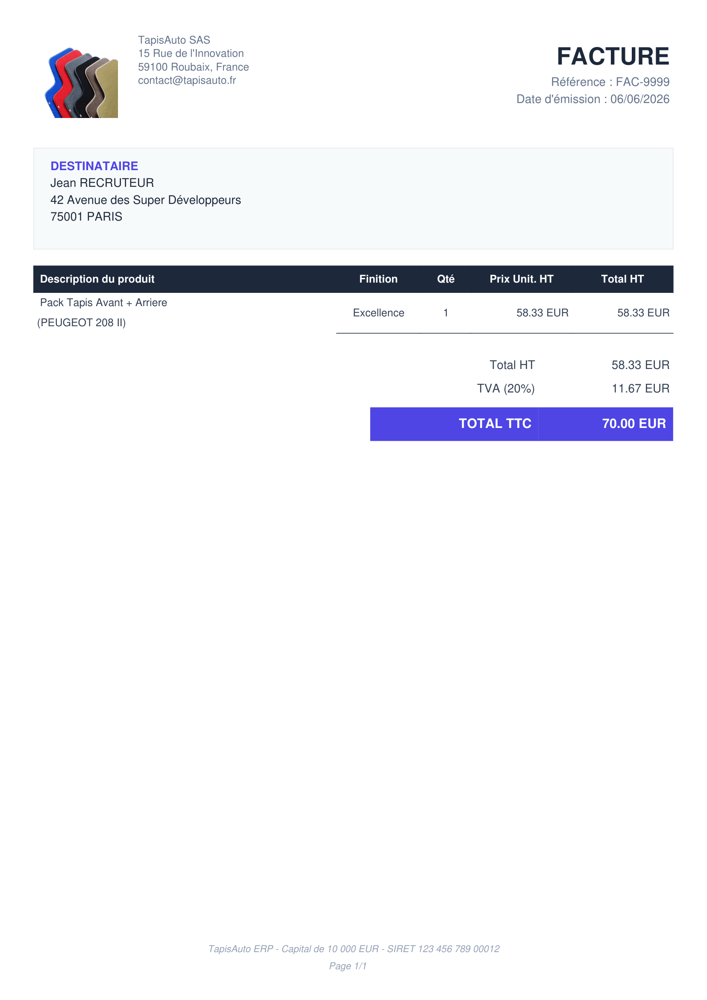
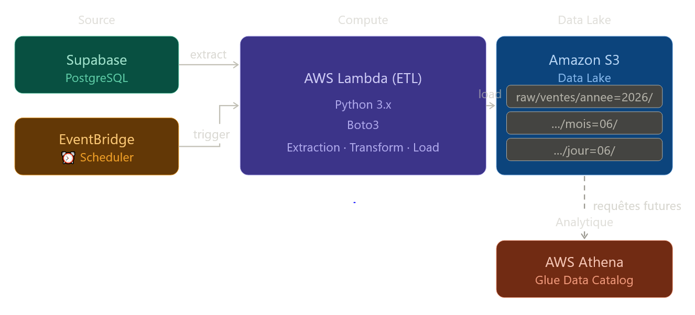
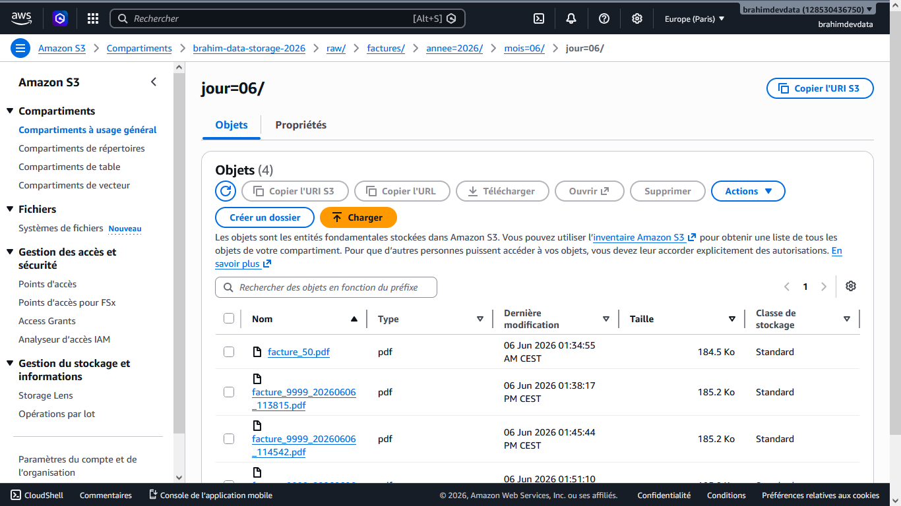
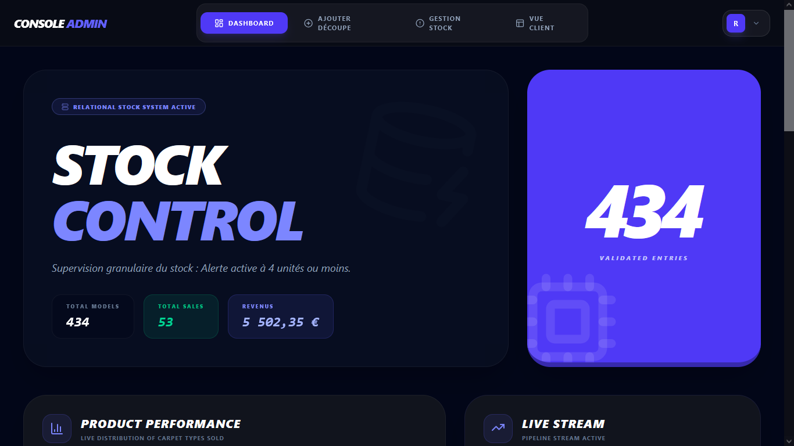
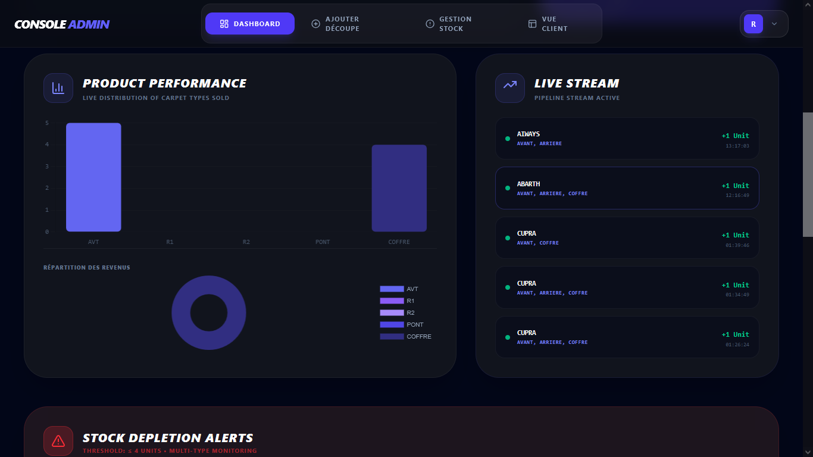
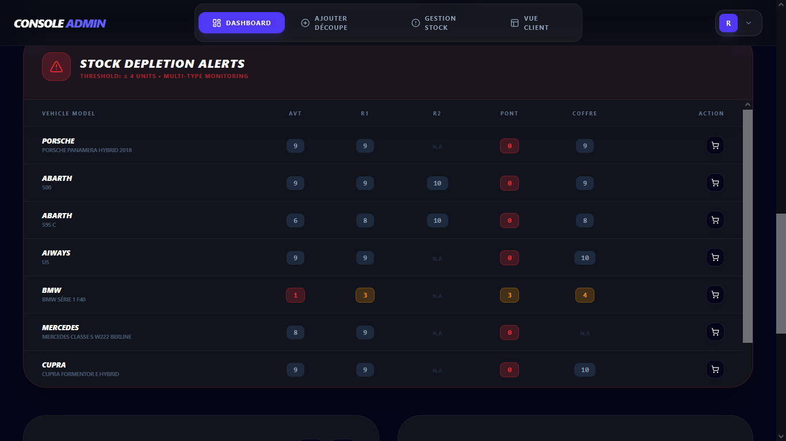
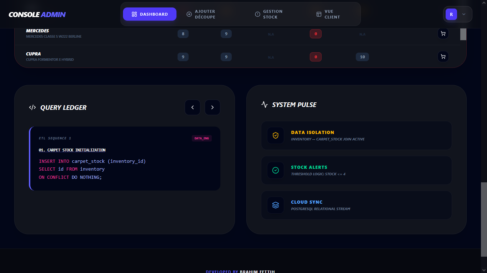
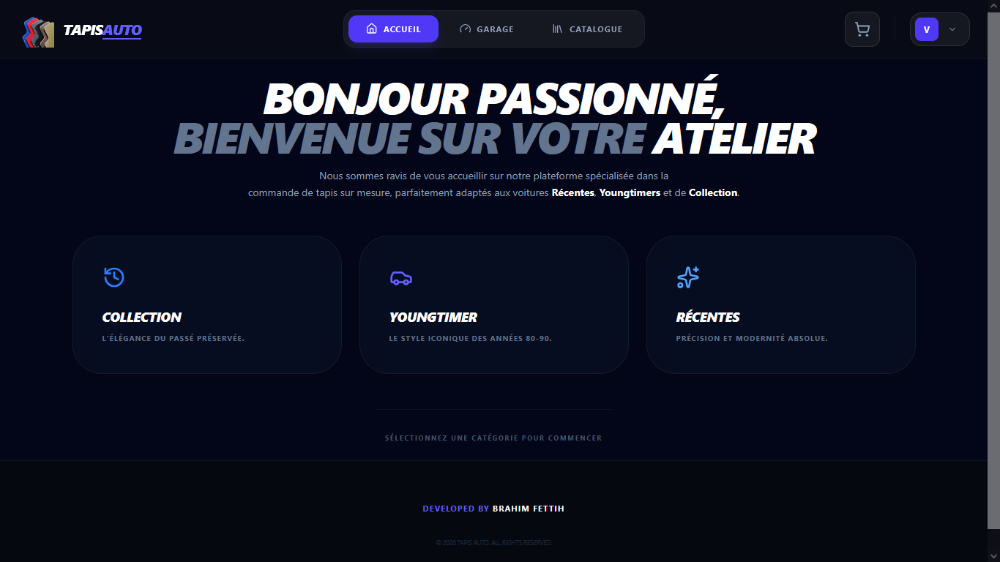
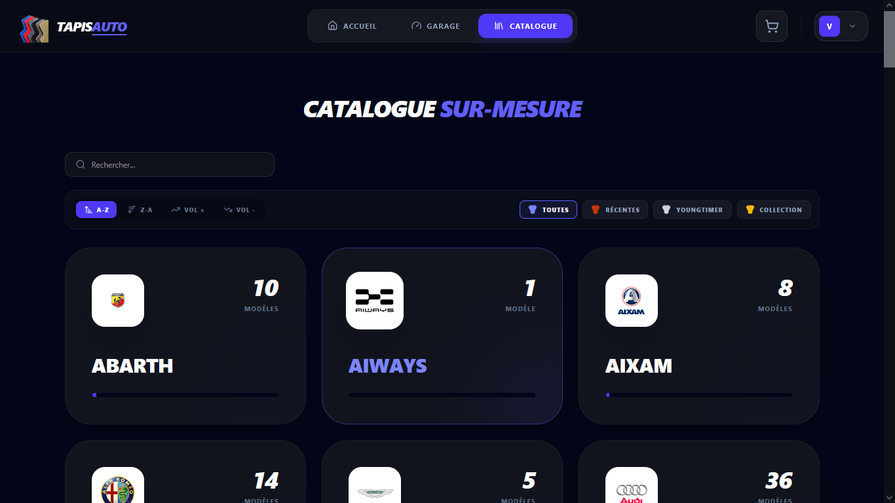

# 🏎️ TapisAuto — Intelligent Automotive Inventory ERP

[](https://geardata-engine.vercel.app/)
[](#architecture)
[](#pipelines)
[](#)

> Système ERP-Light de gestion d'inventaire automobile avec pipeline de données serverless sur AWS — né de la centralisation et de la purification d'un catalogue de **3 000+ références véhicules**.

**[🚀 Demo Live](https://mon-portfolio-data.vercel.app/)** · **[📂 Code Source](https://github.com/bf-data-dv/mon-portfolio-data)**

---

## Table des matières

- [Contexte du projet](#contexte-du-projet)
- [Architecture des données](#architecture-des-données)
- [Pipelines Python](#pipelines-python)
- [Fonctionnalités front-end](#fonctionnalités-front-end)
- [Installation locale](#installation-locale)
- [Variables d'environnement](#variables-denvironnement)

---

## Contexte du projet

TapisAuto résout un problème concret de **gestion de stocks fragmentés** dans le secteur automobile : plusieurs types de produits et finitions par référence véhicule, sans vision unifiée.

Le projet couvre deux phases :

1. **Nettoyage & structuration** d'un dataset CSV brut (doublons, formats hétérogènes, anomalies sur les plages de production) vers un modèle relationnel PostgreSQL normalisé.
2. **Exploitation opérationnelle** via un ERP-Light React connecté à un pipeline ETL serverless automatisé sur AWS.

---

## Architecture des données

L'écosystème applique les patterns industriels de séparation OLTP / Orchestration / Data Lake.

```
┌─────────────────────────────────────────────────────────────────┐
│                        FLUX DE DONNÉES                          │
│                                                                 │
│  AWS EventBridge  ──▶  AWS Lambda (ETL)  ──▶  Amazon S3        │
│      (scheduler)         (Python 3.x)       (Data Lake)        │
│                               │                                 │
│                               ▼                                 │
│              Supabase PostgreSQL (OLTP)                         │
│                    (SQL Views RBAC)                             │
│                               │                                 │
│                               ▼                                 │
│              React.js + Chart.js (ERP Client)                   │
└─────────────────────────────────────────────────────────────────┘
```

| Couche | Composant | Technologie | Rôle |
| :--- | :--- | :--- | :--- |
| **Production DB** | OLTP Database | **Supabase (PostgreSQL)** | Catalogues, états des stocks, historique des ventes. |
| **Orchestration** | Scheduler | **AWS EventBridge** | Déclenchement automatisé et autonome du pipeline à intervalles réguliers. |
| **Compute** | ETL Worker | **AWS Lambda + Python 3.x** | Fonction isolée calculant le delta temporel, extrayant les ventes et appliquant les règles métiers. |
| **Data Lake** | Cold Storage | **Amazon S3** | Stockage durable des fichiers JSON bruts, partitionnés temporellement à la volée. |
| **Abstraction** | Database Layer | **SQL Views** | Abstraction des requêtes lourdes via la vue optimisée `global_inventory_stock`. |
| **Client** | ERP App | **React.js + Chart.js** | Consommation sécurisée (RBAC), monitoring des ventes et reporting d'approvisionnement. |

---

## Pipelines Python

Trois scripts automatisés construits avec `boto3` et `supabase-py`.

### 1. ETL Delta-Loading Serverless · `etl_supabase_ingestion.py`

Déployé sur AWS sous le **principe de moindre privilège IAM**.

- **Fenêtre glissante** : calcul dynamique `datetime.now(UTC) - timedelta(hours=1)` pour capturer uniquement les mutations de la dernière heure, sans surcharge réseau.
- **Jointure relationnelle à la source** : récupération combinée des ventes + tables liées (`inventory`, `qualites_tapis`) en une seule passe API.
- **Partitionnement Hive sur S3 : structuration automatique du chemin raw/ventes/annee=YYYY/mois=MM/jour=DD/. Ce partitionnement type Hive est stratégique : il permet une indexation analytique performante et facilite le requêtage direct via des outils comme AWS Athena ou AWS Glue pour générer des rapports métier sans extraire toute la donnée.

### 2. Alignement & Uniformisation d'Inventaire · `reset_and_uniformize.py`

Initialisation et purge déterministe de l'état des stocks.

- **Mapping conditionnel** : analyse des options habitacle (`tapis_avt`, `tapis_r1`, `tapis_r2`, `tapis_pont`, `tapis_coffre`) pour n'allouer du stock (`STOCK_INITIAL = 10`) qu'aux références réellement fabriquées.
- **Bulk insert optimisé** : insertions regroupées par paquets de 100 lignes pour maximiser le débit d'écriture vers PostgreSQL.

### 3. Simulateur d'Événements Métiers · `simulation_data.py`

Simulation autonome d'une plateforme e-commerce à haute intensité.

- **Vérification d'intégrité transactionnelle** : sélection aléatoire d'un véhicule, vérification de la disponibilité du pack en base, annulation immédiate si rupture.
- **Résolution des clés étrangères (UUID)** : liaison dynamique avec la table `qualites_tapis` avant écriture dans `sales_history`.

---

## Fonctionnalités front-end

| Fonctionnalité | Description |
|---|---|
| 📊 **Smart Stock Tracking** | Suivi granulaire par véhicule + tableau de bord analytique (`react-chartjs-2`) |
| 🛑 **Alertes Supply Chain** | Isolation automatique des produits en rupture critique (seuil ≤ 4 unités) |
| 🛒 **Panier à Clé Composite** | Signature unique `(ID produit × finition × options habitacle)` — zéro collision |
| 📄 **Export PDF Logistique** | Génération de bons de commande fournisseurs en mode paysage (`jsPDF-AutoTable`) |
| 🗺️ **Filtrage Multi-Génération** | Segmentation *Récentes / Youngtimers / Collection* persistée dans les Query Params URL |

---

## Installation locale

```bash
# 1. Cloner le dépôt
git clone https://github.com/bf-data-dv/mon-portfolio-data.git
cd mon-portfolio-data

# 2. Installer les dépendances
npm install

# 3. Configurer l'environnement (voir section suivante)
cp .env.example .env

# 4. Lancer l'application
npm start
```

---

## Variables d'environnement

Créer un fichier `.env` à la racine (déjà dans `.gitignore`) :

```env
REACT_APP_SUPABASE_URL=https://votre-projet.supabase.co
REACT_APP_SUPABASE_ANON_KEY=votre-cle-anonyme-publique
```

> 💡 Les clés de l'infrastructure AWS (Lambda, S3, EventBridge) sont gérées de manière transparente via des rôles d'exécution IAM. Aucune clé secrète ou identifiant AWS n'est inscrit en dur dans le code source.

---

---

## 🚀 Aller plus loin : Architecture Event-Driven & Facturation (Roadmap)

Pour transformer cet ERP-Light en une plateforme e-commerce totalement autonome, la suite logique de l'architecture consiste à implémenter un module de **facturation automatisée Serverless**, déclenché par les événements du Data Lake.

## 🏗️ Workflow de Facturation Cible

```text
┌────────────────┐   ⚡ ObjectCreated   ┌─────────────────┐   📜 Lit le JSON   ┌──────────────────┐
│  Amazon S3     │ ──────────────────── │   AWS Lambda    │ ────────────────── │   Amazon S3      │
│ (Bucket Sales) │                      │ (PDF Generator) │                    │  (Bucket PDFs)   │
└────────────────┘                      └─────────────────┘                    └──────────────────┘
                                                │
                                                │ ✉️ Envoie la facture
                                                ▼
                                        ┌─────────────────┐
                                        │   Amazon SES    │ ────────────────── (Email Client)
                                        └─────────────────┘
```
1. **S3 Event Notification :** Dès que le pipeline principal (`etl_supabase_ingestion.py`) dépose un fichier JSON contenant les mutations de ventes dans le bucket `brahim-data-storage-2026`, S3 émet un événement `ObjectCreated`.
2. **Calcul & Génération Serverless :** Cet événement réveille instantanément une seconde fonction **AWS Lambda** (Python + `FPDF2` / `ReportLab`) qui isole le JSON, calcule les montants HT/TVA/TTC et génère une facture au format PDF hautement personnalisée.
3. **Data Lake Factures :** Le PDF généré est automatiquement archivé de manière immuable et durable dans un compartiment dédié (`raw/factures/annee=YYYY/mois=MM/`).
4. **Notification Métier (Amazon SES) :** En fin de flux, la Lambda s'appuie sur **Amazon SES (Simple Email Service)** pour envoyer la facture par e-mail au client ou à l'équipe comptable en pièce jointe.

### 📝 Prototype de la Lambda de Facturation (`facturation_service.py`)

```python
import json
import boto3
import os
import urllib.parse
from datetime import datetime
from fpdf import FPDF

# Initialisation du client S3
s3 = boto3.client('s3')

def nettoyer_texte(texte):
    """Remplace les caractères spéciaux/exotiques par leurs équivalents standards"""
    if not isinstance(texte, str):
        return texte
    replacements = {
        "—": "-", "–": "-", "’": "'", "…": "...", "€": "EUR"
    }
    for old, new in replacements.items():
        texte = texte.replace(old, new)
    return texte

def lambda_handler(event, context):
    try:
        bucket = event['Records'][0]['s3']['bucket']['name']
        key = urllib.parse.unquote_plus(event['Records'][0]['s3']['object']['key'])
        
        if not key.startswith("raw/ventes/"):
            return {'statusCode': 200, 'body': "Ignoré"}

        parts = key.split('/')
        year = parts[2].split('=')[1]
        month = parts[3].split('=')[1]
        day = parts[4].split('=')[1]
        
        reponse_s3 = s3.get_object(Bucket=bucket, Key=key)
        contenu_json = json.loads(reponse_s3['Body'].read().decode('utf-8'))
        
        for vente in contenu_json:
            nom_pdf = generer_facture(vente)
            filename = os.path.basename(nom_pdf)
            
            target_key = f"raw/factures/annee={year}/mois={month}/jour={day}/{filename}"
            
            with open(nom_pdf, "rb") as f:
                s3.put_object(
                    Bucket=bucket,
                    Key=target_key,
                    Body=f,
                    ContentType='application/pdf'
                )
            os.remove(nom_pdf)
            
        return {'statusCode': 200, 'body': "Succès"}
    except Exception as e:
        print(f"Erreur : {str(e)}")
        return {'statusCode': 500, 'body': str(e)}


class FacturePDF(FPDF):
    """Classe personnalisée pour héberger la structure globale de la facture"""
    def footer(self):
        self.set_y(-15)
        self.set_font("Helvetica", 'I', 8)
        self.set_text_color(148, 163, 184)
        self.cell(0, 10, f"Page {self.page_no()}/{{nb}}", align='C')
        self.set_y(-20)
        self.cell(0, 10, "TapisAuto ERP - Capital de 10 000 EUR - SIRET 123 456 789 00012", align='C')


def generer_facture(vente):
    vente_id = vente.get("id", "unknown")
    date_brute = vente.get("created_at", datetime.now().isoformat())
    
    try:
        date_obj = datetime.strptime(date_brute.split("T")[0], "%Y-%m-%d")
        date_facture = date_obj.strftime("%d/%m/%Y")
    except Exception:
        date_facture = datetime.now().strftime("%d/%m/%Y")
        
    timestamp = datetime.now().strftime("%Y%m%d_%H%M%S")
    nom_fichier = f"/tmp/facture_{vente_id}_{timestamp}.pdf"
    
    profil = vente.get("profiles", {})
    inventory = vente.get("inventory", {})
    qualite = vente.get("qualites_tapis", {})
    items = vente.get("items", [])
    
    marque = nettoyer_texte(inventory.get("marque", "N/A")).upper()
    modele = nettoyer_texte(inventory.get("modele_voiture", "N/A"))
    
    pdf = FacturePDF()
    pdf.alias_nb_pages()
    pdf.add_page()
    
    # ─── EN-TÊTE CORPORATE AVEC LOGO ET TEXTE À DROITE ───────────────────────
    if os.path.exists('logo.png'):
        pdf.image('logo.png', 10, 10, 25) # Logo réduit à 25mm
        pdf.set_x(40) # On décale le texte à droite du logo (25+15 de marge)
        pdf.set_y(10)
        
        # Le titre "TapisAuto" en bleu a été retiré ici
        
        pdf.set_font("Helvetica", size=9)
        pdf.set_text_color(100, 116, 139)
        pdf.cell(100, 4, "TapisAuto SAS", ln=True, x=40)
        pdf.set_x(40)
        pdf.cell(100, 4, "15 Rue de l'Innovation", ln=True)
        pdf.set_x(40)
        pdf.cell(100, 4, "59100 Roubaix, France", ln=True)
        pdf.set_x(40)
        pdf.cell(100, 4, "contact@tapisauto.fr", ln=True)
        pdf.set_y(35) # Repositionnement sous le bloc en-tête
    else:
        pdf.set_y(12)
        pdf.set_font("Helvetica", 'B', 22)
        pdf.set_text_color(79, 70, 229)
        pdf.cell(100, 10, "TapisAuto", ln=False)
        pdf.set_y(22)
        
    # Métadonnées Facture (Alignement à droite)
    pdf.set_y(12)
    pdf.set_x(120)
    pdf.set_font("Helvetica", 'B', 20)
    pdf.set_text_color(30, 41, 59)
    pdf.cell(80, 10, "FACTURE", ln=True, align='R')
    pdf.set_font("Helvetica", size=10)
    pdf.set_text_color(100, 116, 139)
    pdf.set_x(120)
    pdf.cell(80, 5, f"Référence : FAC-{vente_id}", ln=True, align='R')
    pdf.set_x(120)
    pdf.cell(80, 5, f"Date d'émission : {date_facture}", ln=True, align='R')
    
    pdf.ln(12)
    
    # ─── BLOC CLIENT ──────────────────────────────────────────────────
    pdf.set_fill_color(248, 250, 252)
    pdf.set_draw_color(226, 232, 240)
    pdf.rect(10, pdf.get_y(), 190, 30, 'DF')
    pdf.set_y(pdf.get_y() + 3)
    pdf.set_x(14)
    pdf.set_font("Helvetica", 'B', 10)
    pdf.set_text_color(79, 70, 229)
    pdf.cell(180, 5, "DESTINATAIRE", ln=True)
    pdf.set_font("Helvetica", size=10)
    pdf.set_text_color(30, 41, 59)
    
    prenom = nettoyer_texte(profil.get('first_name', 'Client')).capitalize()
    nom = nettoyer_texte(profil.get('last_name', 'Visiteur')).upper()
    num_rue = nettoyer_texte(profil.get('address_number', ''))
    rue = nettoyer_texte(profil.get('address_street', 'Adresse inconnue'))
    cp = profil.get('zip_code', '')
    ville = nettoyer_texte(profil.get('city', '')).upper()
    
    pdf.set_x(14)
    pdf.cell(180, 5, f"{prenom} {nom}", ln=True)
    pdf.set_x(14)
    pdf.cell(180, 5, f"{num_rue} {rue}", ln=True)
    pdf.set_x(14)
    pdf.cell(180, 5, f"{cp} {ville}", ln=True)
    pdf.set_y(pdf.get_y() + 12)
    
    # ─── TABLEAU DES ARTICLES ────────────────────────────────────────────────
    pdf.set_fill_color(30, 41, 59)
    pdf.set_draw_color(30, 41, 59)
    pdf.set_font("Helvetica", 'B', 9)
    pdf.set_text_color(255, 255, 255)
    pdf.cell(90, 8, " Description du produit", 1, 0, 'L', True)
    pdf.cell(25, 8, "Finition", 1, 0, 'C', True)
    pdf.cell(15, 8, "Qté", 1, 0, 'C', True)
    pdf.cell(30, 8, "Prix Unit. HT", 1, 0, 'C', True)
    pdf.cell(30, 8, "Total HT", 1, 1, 'C', True)
    
    pdf.set_font("Helvetica", '', 9)
    pdf.set_text_color(51, 65, 85)
    total_ht = 0
    alterner_fond = False
    
    for item in items:
        libelle = "Pack Tapis Avant"
        if item.get("avec_arriere"): libelle += " + Arriere"
        if item.get("avec_coffre"): libelle += " + Coffre"
        nom_complet = f"{libelle}\n({marque} {modele})"
        prix_ttc_unitaire = float(item.get("prix_base", 0)) + float(item.get("prix_arriere", 0) if item.get("avec_arriere") else 0) + float(item.get("prix_coffre", 0) if item.get("avec_coffre") else 0)
        prix_ht_unitaire = prix_ttc_unitaire / 1.20
        qte = item.get("quantite", 0)
        ligne_ht = qte * prix_ht_unitaire
        total_ht += ligne_ht
        
        pdf.set_fill_color(248, 250, 252) if alterner_fond else pdf.set_fill_color(255, 255, 255)
        current_x, current_y = pdf.get_x(), pdf.get_y()
        pdf.rect(current_x, current_y, 90, 12, 'F')
        pdf.multi_cell(90, 6, f" {nom_complet}", border=0, align='L', fill=True)
        pdf.set_xy(current_x + 90, current_y)
        pdf.cell(25, 12, nettoyer_texte(qualite.get("nom", "Classique")).capitalize(), border='B', align='C', fill=True)
        pdf.cell(15, 12, str(qte), border='B', align='C', fill=True)
        pdf.cell(30, 12, f"{prix_ht_unitaire:.2f} EUR", border='B', align='R', fill=True)
        pdf.cell(30, 12, f"{ligne_ht:.2f} EUR", border='B', align='R', fill=True)
        pdf.set_y(current_y + 12)
        alterner_fond = not alterner_fond
        
    pdf.ln(6)
    pdf.set_x(110)
    pdf.set_font("Helvetica", '', 10)
    pdf.cell(50, 7, "Total HT", 0, 0, 'R')
    pdf.cell(40, 7, f"{total_ht:.2f} EUR", 0, 1, 'R')
    pdf.set_x(110)
    pdf.cell(50, 7, "TVA (20%)", 0, 0, 'R')
    pdf.cell(40, 7, f"{total_ht * 0.20:.2f} EUR", 0, 1, 'R')
    pdf.ln(2)
    pdf.set_x(110)
    pdf.set_fill_color(79, 70, 229)
    pdf.set_font("Helvetica", 'B', 11)
    pdf.set_text_color(255, 255, 255)
    pdf.cell(50, 10, "TOTAL TTC ", 0, 0, 'R', True)
    pdf.cell(40, 10, f"{total_ht * 1.20:.2f} EUR ", 0, 1, 'R', True)
    
    pdf.output(nom_fichier)
    return nom_fichier

```    

## Aperçu du rendu
Voici à quoi ressemble une facture générée par le système :

<p align="center">
  
</p>

---

## Fonctionnement
- Le système détecte le JSON dans le bucket `raw/ventes/`.
- La fonction Lambda traite les données.
- Le PDF final est déposé dans `raw/factures/`.

💼 Accès Recruteur / Version Démo

Pour explorer l'interface d'administration, interagir avec le dashboard temps réel et tester le tunnel utilisateur sans altérer l'inventaire de production, vous pouvez utiliser le compte de test suivant :

    🌐 Lien de l'application : https://mon-portfolio-data.vercel.app

    🔑 Identifiant Admin : recruteur@tapisauto.fr

    🔒 Mot de passe : WelcomeData2026!

    🔑 Identifiant Utilisateur : visiteur@tapisauto.fr

    🔒 Mot de passe : Visiteur2026!

    ⚠️ Note sur la sécurité du mode démo : Conformément aux bonnes pratiques de Data Engineering et pour préserver l'intégrité de la base de données, les actions sensibles d'écriture (INSERT/UPDATE/DELETE) ainsi que la validation finale du panier ont été sécurisées et bridées spécifiquement pour ce compte d'inspection. Pour tester le tunnel d'achat complet sans restriction sur les stocks, veuillez utiliser le profil visiteur mis à disposition sur l'interface de connexion.

 📊 Documentation Visuelle du Système

Voici un aperçu de l'infrastructure, du monitoring et des fonctionnalités de l'ERP.

1. Architecture & Data Engineering

Le pipeline repose sur une architecture serverless robuste, avec un partitionnement Hive pour une gestion optimisée des données.

<p align="center">
  
  <br>
  <em><strong>Schéma d'architecture :</strong> Flux ETL automatisé entre Supabase et le Data Lake S3.</em>
</p>

<p align="center">
  
  <br>
  <em><strong>Partitionnement S3 :</strong> Organisation selon le standard Hive (annee/mois/jour) pour une indexation analytique performante.</em>
</p>

2. Console d'Administration (Monitoring & ERP)

L'interface d'administration permet un pilotage en temps réel des flux de données et des stocks.

<div align="center">
  <table border="0">
    <tr>
      <td></td>
      <td></td>
    </tr>
    <tr>
      <td></td>
      <td></td>
    </tr>
  </table>
  <em><strong>Console Admin :</strong> Vue d'ensemble des KPIs, monitoring des flux "Live", système d'alerting sur stocks critiques, et traçabilité SQL intégrée.</em>
</div>

3. Interface Utilisateur (Frontend)

Une expérience simplifiée pour la navigation dans le catalogue automobile. 

<p align="center">
  
  
  <br>
  <em><strong>Interface Client :</strong> Vue d'accueil personnalisée et navigation structurée dans le catalogue de produits.</em>
</p>

👤 Auteur

Développé avec passion par Brahim Fettih — Concepteur Développeur d'Applications (CDA) diplômé de l'AFPA, admis à la Wild Code School et activement à la recherche d'une alternance en Data Engineering.

### 🛠️ Compétences clés mises en œuvre
* **Cloud Architecture** : AWS (Lambda, S3, EventBridge, IAM).
* **Data Engineering** : Pipeline ETL, Delta-loading, Partitionnement de Data Lake (Hive).
* **Backend & Automatisation** : Python, Boto3, Génération PDF dynamique.
* **Fullstack** : React.js, Supabase (PostgreSQL), Gestion RBAC.